<p align="center">
  
  
  
  
</p>

<h1 align="center">🌧️ Rain on Umbrella</h1>

<p align="center">
  <strong>A mesmerizing, physics-based rain animation with realistic water dynamics</strong>
</p>

<p align="center">
  An immersive Canvas animation featuring heavy rain falling on an open umbrella, complete with realistic raindrop physics, splash effects, water sliding mechanics, puddle ripples, and dynamic wind gusts.
</p>

<p align="center">
  <a href="#-key-features">Features</a> •
  <a href="#-quick-start">Quick Start</a> •
  <a href="#-architecture">Architecture</a> •
  <a href="#-contributing">Contributing</a> •
  <a href="#-license">License</a>
</p>

---

## 📖 Introduction

**Rain on Umbrella** is a single-file, zero-dependency web animation that brings the peaceful atmosphere of a rainy day to your browser. Built entirely with vanilla HTML5, CSS3, and JavaScript, this project demonstrates advanced Canvas API techniques for creating realistic water physics simulations.

Whether you're looking for a relaxing visual experience, studying Canvas animation techniques, or seeking inspiration for your own creative coding projects, Rain on Umbrella offers an elegant, performant solution that runs smoothly in any modern browser.

### Why This Project?

- **🎓 Educational**: Learn advanced Canvas API patterns, particle systems, and physics simulations
- **🚀 Zero Dependencies**: No frameworks, no build tools, no npm packages — just pure web technologies
- **📱 Responsive**: Optimized for various screen sizes with smooth 60fps performance
- **🎨 Beautiful**: Carefully crafted aesthetics with gradient backgrounds, realistic colors, and subtle details

---

## ✨ Key Features

| Feature | Description |
|---------|-------------|
| **🌧️ Realistic Raindrops** | 400+ concurrent raindrops with varying sizes, speeds, and opacity for depth perception |
| **☂️ Interactive Umbrella** | Beautifully rendered umbrella with 8 fabric segments, gradient shading, and scalloped edges |
| **💦 Splash Physics** | Particle-based splash effects when raindrops hit the umbrella surface |
| **🌊 Water Sliding** | Drops realistically slide along the curved umbrella surface towards the edges |
| **💧 Dripping Effect** | Water accumulates and drips from umbrella edges with gravity simulation |
| **🔵 Puddle Ripples** | Expanding elliptical ripples on the ground when drops hit the surface |
| **💨 Wind Gusts** | Random wind patterns that tilt the umbrella and affect rain direction |
| **🔄 Seamless Loop** | Infinite, smooth animation with no visible restart points |

### Animation Physics


---

## 🏗️ Architecture

### System Overview

Rain on Umbrella follows a component-based architecture pattern, utilizing ES6 classes for each distinct visual element:


### Core Components

| Component | Purpose | File Location |
|-----------|---------|---------------|
| `Raindrop` | Manages individual raindrop lifecycle, movement, and collision detection | `rain-umbrella.html` (Line 94-182) |
| `UmbrellaSplash` | Particle system for splash effects on umbrella contact | `rain-umbrella.html` (Line 185-227) |
| `Ripple` | Expanding circular ripple effects on ground impact | `rain-umbrella.html` (Line 230-255) |
| `SlidingDrop` | Water drops sliding along umbrella curve | `rain-umbrella.html` (Line 258-305) |
| `DrippingDrop` | Gravity-affected drops falling from umbrella edges | `rain-umbrella.html` (Line 310-339) |

### Render Pipeline


---

## 🚀 Installation

### Prerequisites

- Any modern web browser (Chrome, Firefox, Safari, Edge)
- No additional dependencies required!

### Quick Install

```bash
# Clone the repository
git clone https://github.com/yourusername/rain-umbrella.git

# Navigate to project directory
cd rain-umbrella

# That's it! No npm install, no build step needed
```

### Alternative: Direct Download

1. Download `rain-umbrella.html` directly
2. Save it to any location on your computer
3. Done!

---

## ▶️ Running the Project

### Option 1: Direct File Open

Simply double-click `rain-umbrella.html` or drag it into your browser:

```bash
# Windows
start rain-umbrella.html

# macOS
open rain-umbrella.html

# Linux
xdg-open rain-umbrella.html
```

### Option 2: Local Development Server

For development with live reload capabilities:

```bash
# Using Python 3
python -m http.server 8000

# Using Node.js (npx)
npx serve .

# Using PHP
php -S localhost:8000
```

Then open `http://localhost:8000/rain-umbrella.html` in your browser.

### Option 3: VS Code Live Server

1. Install the [Live Server extension](https://marketplace.visualstudio.com/items?itemName=ritwickdey.LiveServer)
2. Right-click on `rain-umbrella.html`
3. Select "Open with Live Server"

---

## ⚙️ Configuration

### Customizable Parameters

All configuration is done by modifying values in the JavaScript section of `rain-umbrella.html`:

#### Canvas Size

```javascript
// Line 35-36
canvas.width = 900;   // Adjust canvas width
canvas.height = 700;  // Adjust canvas height
```

#### Color Scheme

```javascript
// Line 39-52: Customize the color palette
const colors = {
    sky: ['#1a1a2e', '#16213e', '#0f3460'],  // Background gradient
    umbrella: {
        fabric: '#e94560',           // Main umbrella color
        fabricDark: '#b8304f',       // Shading
        fabricHighlight: '#ff6b6b',  // Highlights
        pole: '#4a4a4a',             // Pole color
        poleHighlight: '#6a6a6a'     // Pole shine
    },
    rain: 'rgba(200, 220, 255, 0.6)',     // Raindrop color
    splash: 'rgba(180, 200, 230, 0.8)',   // Splash particles
    ground: '#1a1a2e',                     // Ground base
    puddle: 'rgba(100, 150, 200, 0.3)'    // Puddle tint
};
```

#### Umbrella Configuration

```javascript
// Line 55-64
const umbrella = {
    x: canvas.width / 2,    // Horizontal position
    y: canvas.height / 2 - 50,  // Vertical position
    width: 280,             // Umbrella width
    height: 80,             // Curve height
    poleLength: 200,        // Pole length
    segments: 8             // Number of fabric segments
};
```

#### Rain Intensity

```javascript
// Line 71: Adjust rain density
const maxRaindrops = 400;  // Increase for heavier rain
```

#### Wind Behavior

```javascript
// Line 505-513: Wind gust frequency and strength
wind.gustDuration = Math.random() * 4000 + 3000;  // 3-7 seconds between gusts
wind.targetStrength = (Math.random() - 0.5) * 4; // Wind strength range
```

---

## 📁 Folder Structure

```
rain-umbrella/
│
├── 📄 rain-umbrella.html    # Single-file application with HTML, CSS, and JavaScript
│   │
│   ├── 🎨 <style>           # Embedded CSS styles
│   │   ├── Reset styles
│   │   ├── Body centering with flexbox
│   │   └── Canvas styling with shadows
│   │
│   └── 📜 <script>          # Embedded JavaScript
│       ├── Canvas setup & configuration
│       ├── Color palette definition
│       ├── Umbrella parameters
│       ├── Class: Raindrop
│       ├── Class: UmbrellaSplash
│       ├── Class: Ripple
│       ├── Class: SlidingDrop
│       ├── Class: DrippingDrop
│       ├── Drawing functions
│       ├── Wind simulation
│       └── Animation loop
│
└── 📄 README.md             # This documentation file
```

---

## 🤝 Contributing

We welcome contributions from developers of all skill levels! Here's how you can help:

### Ways to Contribute

- 🐛 **Bug Reports**: Found a bug? Open an issue with reproduction steps
- 💡 **Feature Requests**: Have an idea? We'd love to hear it
- 📝 **Documentation**: Help improve this README or add inline comments
- 🎨 **Visual Enhancements**: Propose new color schemes or visual effects
- ⚡ **Performance**: Optimize the animation for better frame rates

### Contribution Workflow

```mermaid
flowchart LR
    A[Fork Repository] --> B[Create Branch]
    B --> C[Make Changes]
    C --> D[Test Locally]
    D --> E[Commit Changes]
    E --> F[Push to Fork]
    F --> G[Open Pull Request]
    G --> H{Review}
    H -->|Approved| I[Merge! 🎉]
    H -->|Changes Requested| C
```



### Development Guidelines

1. **Fork** the repository
2. **Create** a feature branch:
   ```bash
   git checkout -b feature/amazing-new-effect
   ```
3. **Make** your changes following our code style:
   - Use meaningful variable names
   - Add comments for complex logic
   - Keep functions focused and small
4. **Test** thoroughly in multiple browsers
5. **Commit** with clear messages:
   ```bash
   git commit -m "feat: add lightning effect during heavy rain"
   ```
6. **Push** to your fork:
   ```bash
   git push origin feature/amazing-new-effect
   ```
7. **Open** a Pull Request with a detailed description

### Commit Message Convention

We follow the [Conventional Commits](https://www.conventionalcommits.org/) specification:

| Type | Description |
|------|-------------|
| `feat` | New feature |
| `fix` | Bug fix |
| `docs` | Documentation changes |
| `style` | Code style changes (formatting, etc.) |
| `refactor` | Code refactoring |
| `perf` | Performance improvements |
| `test` | Adding or updating tests |

---

## 📄 License

This project is licensed under the **MIT License** — see the details below:

```
MIT License

Copyright (c) 2025 Rain Umbrella Project

Permission is hereby granted, free of charge, to any person obtaining a copy
of this software and associated documentation files (the "Software"), to deal
in the Software without restriction, including without limitation the rights
to use, copy, modify, merge, publish, distribute, sublicense, and/or sell
copies of the Software, and to permit persons to whom the Software is
furnished to do so, subject to the following conditions:

The above copyright notice and this permission notice shall be included in all
copies or substantial portions of the Software.

THE SOFTWARE IS PROVIDED "AS IS", WITHOUT WARRANTY OF ANY KIND, EXPRESS OR
IMPLIED, INCLUDING BUT NOT LIMITED TO THE WARRANTIES OF MERCHANTABILITY,
FITNESS FOR A PARTICULAR PURPOSE AND NONINFRINGEMENT. IN NO EVENT SHALL THE
AUTHORS OR COPYRIGHT HOLDERS BE LIABLE FOR ANY CLAIM, DAMAGES OR OTHER
LIABILITY, WHETHER IN AN ACTION OF CONTRACT, TORT OR OTHERWISE, ARISING FROM,
OUT OF OR IN CONNECTION WITH THE SOFTWARE OR THE USE OR OTHER DEALINGS IN THE
SOFTWARE.
```

---

## 🗺️ Roadmap

### Current Version: v1.0.0 ✅

- [x] Core rain animation system
- [x] Umbrella rendering with segments and gradients
- [x] Splash particle effects
- [x] Water sliding mechanics
- [x] Dripping from umbrella edges
- [x] Ground puddle ripples
- [x] Dynamic wind gusts

### Upcoming Features


### Planned Enhancements

| Priority | Feature | Status |
|----------|---------|--------|
| 🔴 High | Add audio (rain ambience, thunder) | Planned |
| 🔴 High | Settings panel for real-time adjustments | Planned |
| 🟡 Medium | Lightning flash effects | Planned |
| 🟡 Medium | Multiple color themes | Planned |
| 🟡 Medium | Mobile touch controls | Planned |
| 🟢 Low | Fog/mist effect | Considering |
| 🟢 Low | Day/night transitions | Considering |
| 🟢 Low | Snow mode alternative | Considering |

### How to Request Features

Have an idea? We'd love to hear it! Please:

1. Check if it's already in the roadmap above
2. Open a GitHub issue with the `enhancement` label
3. Describe the feature and its benefits

---

<p align="center">
  Made with ❤️ and ☕
</p>

<p align="center">
  <sub>If you found this project helpful, please consider giving it a ⭐</sub>
</p>
